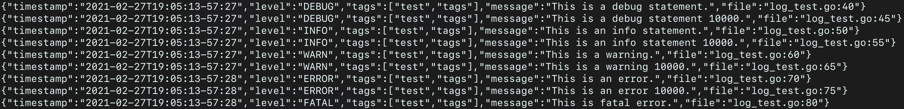

# go-parkhub-logger

This package provides a singular interface to create logs as well as filtering them out based on level.  It also provides two types of formatting json, pretty.  This logger doesn't ship any logs.

## Features

The logger mimics the `log` package's `Println`, `Printf`, `Fatalln` and `Fatalf` functions with some extra features.
Like the `log` package, all log functions will end with a new line.

	- [X] Log levels
	- [X] JSON formatted output
	- [X] Tags
	- [X] Colorized output
	- [X] Exact timestamps
	- [X] File and line numbers
	- [X] Attach data to logs

## Installing

Add this package to your project's mod file.

```bash
$ go get github.com/parkhub/go-parkhub-logger
```

## Setup

The package contains a couple of setup convenience methods for local and cloud development.

### Local Logging

Call `SetupLocalLogger` to setup local logging with the desired log level.

```go
log.SetupLocalLogger(LogLevelDebug)
```

Local logging contains pretty output, colorized output and no tags. The local logger outputs logs like the following:


### Cloud Logging

Call `SetupCloudLogger` to set up cloud logging with the desired log level and tags.

```go
log.SetupCloudLogger(LogLevelInfo, []string{"test", "tags"})
```

Cloud logging contains JSON output, non-colorized output and tags. The cloud logger outputs logs like the following:



### Custom Logging

Call `SetupLogger` to specify your own properties.

```go
// Setup the logger with
// - Debug log level
// - Pretty output
// - Non-colorized output
// - File and line numbers
// - Use the tags "live" and "analytics"
SetupLogger(LogLevelDebug, LogFormatPretty, false, true, []string{"live", "analytics"})
```

## Printing Data

Along with the usual "ln" and "f" print functions, the logger includes functions for attaching data to a log using the `Debugd`, `Infod`, etc. functions.

The following:

```go
type testStruct struct {
	Name string
	Kind string
}

test := &testStruct{
	Name: "Logan",
	Kind: "Log",
}

log.Warnd("Unable to consume object data.", test)
```

Produces the output:

```bash
2021-02-27T18:08:48-74:94 [WARN] Unable to consume object data. &{Name:Logan Kind:Log}
```

## Example

```go
package main

import (
	log "github.com/parkhub/go-parkhub-logger"
)

func main() {
	// Setup the logger
	if os.Getenv("LOGGING") == "local" {
		log.SetupLocalLogger(log.LogLevelDebug)
	} else {
		log.SetupCloudLogger(log.LogLevelInfo, []string{"test", "tags"})
	}

	// Print info statement
	log.Infoln("This is an info statement.")

	// Print info statement with data
	type testStruct struct {
		Name string
		Kind string
	}

	test := &testStruct{
		Name: "Logan",
		Kind: "Log",
	}
	
	// Print trace text
	log.Traceln("This is a trace statement.")
	
	// Print trace text with additional data
	log.Traced("This is a trace statement with data.", test)
	
	// Print a formatted trace statement
	log.Tracef("This is a formatted trace statement (%d).", 10000)

	// Print debug text
	log.Debugln("This is a debug statement.")

	// Print debug text with additional data.
	log.Debugf("This is a debug statement %d.", 10000)

	// Print info text
	log.Infoln("This is an info statement.")

	// Print info text with additional data.
	log.Infof("This is an info statement %d.", 10000)

	// Print warn text
	log.Warnln("This is a warning.")

	// Print warn text with additional data.
	log.Warnf("This is a warning %d.", 10000)

	// Print error text
	log.Errorln("This is an error.")

	// Print error text with additional data.
	log.Errorf("This is an error %d.", 10000)

	// Print fatal text
	log.Fatalln("This is an error.")

	// Print fatal text with additional data.
	log.Fatalf("This is an error %d.", 10000)
}
```

## Sub-Loggers

The tags provided when setting up the logger will be included in every log
statement, and so should apply to the entire application instance. For more
granular tags that apply only to a package or a function, the `Sublogger`
function returns a `Logger` that will include additional tags where it is used
instead of the default logger. It does not affect the default logger.

The `Sublogger` function creates a logger from the default Logger, but a
sub-logger can be created from any Logger, even a sub-logger, and will inherit
all of its tags.

### Example

```go
package main

import (
    log "github.com/parkhub/go-parkhub-logger"
)

func main() {
    log.SetupCloudLogger(log.LogLevelInfo, []string{"environment", "platform", "application"})
    
    sl := log.Sublogger("package", "function")
    
    log.Debugln("with default logger")
    // tagged ["environment", "platform", "application"]
    
    sl.Debugln("with sub-logger")
    // tagged ["environment", "platform", "application", "package", "function"]
    
    sl2 := sl.Sublogger("super-fine")
    sl2.Debugln("with sub-sub-logger")
	// tagged ["environment", "platform", "application", "package", "function", "super-fine"]
}

```


## Request Logging

The package also includes a `RequestLogger` type that provides an `http.Handler`
by its `Handle` method. The handler logs all incoming HTTP requests, logging
the request method, the requested path, the time it took to complete the
request, and whether the request was canceled, timed out, or had another context
error.

The RequestLogger config accepts boolean properties for whether to include the
headers, params, and/or body in the log, allows for specifying a logger other
than the default logger, and any additional tags you'd like included on request
logs.

| Request Status    | Log Level |
|-------------------|-----------|
| Canceled          | Warn      |
| Deadline exceeded | Warn      |
| Other error       | Error     |
| Success           | Debug     |

### Example

```go
package main

import (
	"net/http"
	_ "net/http/pprof"

	"github.com/gorilla/mux"
	log "github.com/parkhub/go-parkhub-logger"
)

func main() {
	log.SetupLogger(
		log.LogLevelDebug,
		log.LogFormatPretty,
		false,
		false,
		[]string{"some-api", "develop"},
	)

	rl := log.NewRequestLogger(log.RequestLoggerConfig{
		Headers: false,
		Params:  true,
		Body:    false,
		Tags:    []string{"http-requests"},
	})

	router := mux.NewRouter()

	// log all incoming requests as middleware
	router.Use(rl.Handle)

	// alternately, log all incoming requests on single route
	routeHandler := http.HandlerFunc(func(rw http.ResponseWriter, r *http.Request) {
		// some route handler
	})
	router.Handle("/some-route", rl.Handle(routeHandler))
	
	sl := log.Sublogger("debug-routes")
	drl := log.NewRequestLogger(log.RequestLoggerConfig{
			Logger:  sl,
			Headers: true,
			Tags:    []string{"profiling"},
    })
	router.PathPrefix("/debug").Handler(drl.Handle(http.DefaultServeMux))
	// tags ["some-api", "develop", "debug", "profiling"]

	// etc. ...

	srv := &http.Server{
		Handler:      router,
		Addr:         ":8080",
		WriteTimeout: 10 * time.Second,
		ReadTimeout:  5 * time.Second,
	}
	_ = srv.ListenAndServe()
}
```

## Panic Recovery

The `Recover` function can be deferred in code to recover from a panic and log
it as an error instead, and continue. If an error reference is provided, it can
be used to capture the panic as an error to return.

### Example

```shell
// exampleFunction will panic if index is greater than the length of slice - 1
func exampleFunction(index int, slice []interface{}) interface{} {
  return slice[index]
}

// goroutine returns no error, but calls a function that may panic
func goroutine() {
  defer Recover("goroutine", nil)
  _ = exampleFunction(1, nil)
}

// goroutine2 returns an error set if function recovers from a panic
func goroutine2() (err error) {
  defer Recover("goroutine2", &err)
  panic("fatal error!")
}
```
